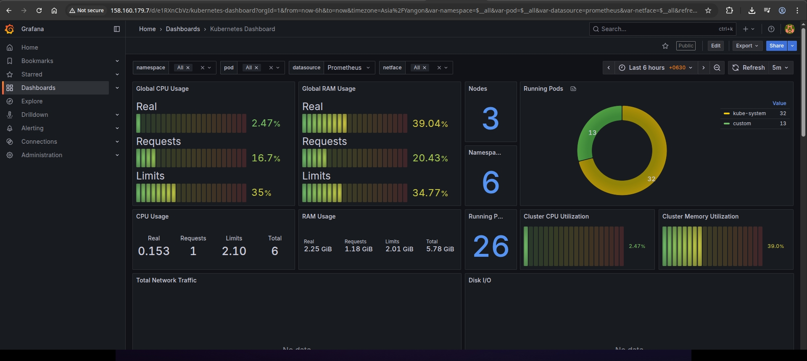

# Дипломный практикум в Yandex.Cloud
  * [Цели:](#цели)
  * [Этапы выполнения:](#этапы-выполнения)
     * [Создание облачной инфраструктуры](#создание-облачной-инфраструктуры)
     * [Создание Kubernetes кластера](#создание-kubernetes-кластера)
     * [Создание тестового приложения](#создание-тестового-приложения)
     * [Подготовка cистемы мониторинга и деплой приложения](#подготовка-cистемы-мониторинга-и-деплой-приложения)
     * [Установка и настройка CI/CD](#установка-и-настройка-cicd)
  * [Что необходимо для сдачи задания?](#что-необходимо-для-сдачи-задания)
  * [Как правильно задавать вопросы дипломному руководителю?](#как-правильно-задавать-вопросы-дипломному-руководителю)

**Перед началом работы над дипломным заданием изучите [Инструкция по экономии облачных ресурсов](https://github.com/netology-code/devops-materials/blob/master/cloudwork.MD).**

---
## Цели:

1. Подготовить облачную инфраструктуру на базе облачного провайдера Яндекс.Облако.
2. Запустить и сконфигурировать Kubernetes кластер.
3. Установить и настроить систему мониторинга.
4. Настроить и автоматизировать сборку тестового приложения с использованием Docker-контейнеров.
5. Настроить CI для автоматической сборки и тестирования.
6. Настроить CD для автоматического развёртывания приложения.

---
## Этапы выполнения:


### Создание облачной инфраструктуры

Для начала необходимо подготовить облачную инфраструктуру в ЯО при помощи [Terraform](https://www.terraform.io/).

Особенности выполнения:

- Бюджет купона ограничен, что следует иметь в виду при проектировании инфраструктуры и использовании ресурсов;
Для облачного k8s используйте региональный мастер(неотказоустойчивый). Для self-hosted k8s минимизируйте ресурсы ВМ и долю ЦПУ. В обоих вариантах используйте прерываемые ВМ для worker nodes.

Предварительная подготовка к установке и запуску Kubernetes кластера.

> 1. Создайте сервисный аккаунт, который будет в дальнейшем использоваться Terraform для работы с инфраструктурой с необходимыми и достаточными правами. Не стоит использовать права суперпользователя

Для выполнения потребовалось создать аккаунт с ролью storage.admin . 

> 2. Подготовьте [backend](https://developer.hashicorp.com/terraform/language/backend) для Terraform:  
   а. Рекомендуемый вариант: S3 bucket в созданном ЯО аккаунте(создание бакета через TF)
   б. Альтернативный вариант:  [Terraform Cloud](https://app.terraform.io/)

Код для создания бакета яндекс и сервисного аккаунта
https://github.com/WilderWein123/devops-diplom-yandexcloud/tree/main/terraform-bucket

> 3. Создайте конфигурацию Terrafrom, используя созданный бакет ранее как бекенд для хранения стейт файла. Конфигурации Terraform для создания сервисного аккаунта и бакета и основной инфраструктуры следует сохранить в разных папках.

- Основной код REPOROOT/terraform
- Код создания бакета REPOROOT/terraform-bucket
- После создания бакета выхлоп отправляется в 2 временных файла в директорию REPOROOT/private (добавлена в целях безопасности в gitingore), по завершении деплоя выполняем `terraform init -backend-config="access_key=$ACCESS_KEY" -backend-config="secret_key=$SECRET_KEY"`

> 4. Создайте VPC с подсетями в разных зонах доступности.
> 5. Убедитесь, что теперь вы можете выполнить команды `terraform destroy` и `terraform apply` без дополнительных ручных действий.
> 6. В случае использования [Terraform Cloud](https://app.terraform.io/) в качестве [backend](https://developer.hashicorp.com/terraform/language/backend) убедитесь, что применение изменений успешно проходит, используя web-интерфейс Terraform cloud.

Подтверждаю. Скриншот:


Стейт в оьблаке яндекса (скриншот после создания kubernetes-кластера, т.к. изначально стейт пустой):


Скриншот бакета в яндкесе (скриншот после создания kubernetes-кластера, т.к. изначально стейт пустой):


Ожидаемые результаты:

1. Terraform сконфигурирован и создание инфраструктуры посредством Terraform возможно без дополнительных ручных действий, стейт основной конфигурации сохраняется в бакете или Terraform Cloud
2. Полученная конфигурация инфраструктуры является предварительной, поэтому в ходе дальнейшего выполнения задания возможны изменения.

---
### Создание Kubernetes кластера

На этом этапе необходимо создать [Kubernetes](https://kubernetes.io/ru/docs/concepts/overview/what-is-kubernetes/) кластер на базе предварительно созданной инфраструктуры.   Требуется обеспечить доступ к ресурсам из Интернета.

Это можно сделать двумя способами:

> 1. Рекомендуемый вариант: самостоятельная установка Kubernetes кластера.  
>    а. При помощи Terraform подготовить как минимум 3 виртуальных машины Compute Cloud для создания Kubernetes-кластера. Тип виртуальной машины следует выбрать самостоятельно с учётом требовании к производительности и стоимости. Если в дальнейшем поймете, что необходимо сменить тип инстанса, используйте Terraform для внесения изменений.  
>    б. Подготовить [ansible](https://www.ansible.com/) конфигурации, можно воспользоваться, например [Kubespray](https://kubernetes.io/docs/setup/production-environment/tools/kubespray/)  
>    в. Задеплоить Kubernetes на подготовленные ранее инстансы, в случае нехватки каких-либо ресурсов вы всегда можете создать их при помощи Terraform.
> 2. Альтернативный вариант: воспользуйтесь сервисом [Yandex Managed Service for Kubernetes](https://cloud.yandex.ru/services/managed-kubernetes)  
>   а. С помощью terraform resource для [kubernetes](https://registry.terraform.io/providers/yandex-cloud/yandex/latest/docs/resources/kubernetes_cluster) создать **региональный** мастер kubernetes с размещением нод в разных 3 подсетях      
>  б. С помощью terraform resource для [kubernetes node group](https://registry.terraform.io/providers/yandex-cloud/yandex/latest/docs/resources/kubernetes_node_group)
  
Ожидаемый результат:

1. Работоспособный Kubernetes кластер.
2. В файле `~/.kube/config` находятся данные для доступа к кластеру.
3. Команда `kubectl get pods --all-namespaces` отрабатывает без ошибок.

Добавил к автоматизации генерацию конфиг файла для kbuernetes через шаблон kubeconfig.tpl. Файл генерируется в директорию /private (gitignore). Соответственно для подключения к инфраструктуре достаточно выполнить:

```
sudo cp ~/scripts/devops-diplom-yandexcloud/devops-diplom-yandexcloud/private/config ~/.kube
```

Kubernetes еще поднимается, но тем не менее мастер уже готов, и статус вполне возможно получить:


Скриншот яндекса:


---
### Создание тестового приложения

Для перехода к следующему этапу необходимо подготовить тестовое приложение, эмулирующее основное приложение разрабатываемое вашей компанией.

Способ подготовки:

1. Рекомендуемый вариант:  
   а. Создайте отдельный git репозиторий с простым nginx конфигом, который будет отдавать статические данные.  
   б. Подготовьте Dockerfile для создания образа приложения.  
2. Альтернативный вариант:  
   а. Используйте любой другой код, главное, чтобы был самостоятельно создан Dockerfile.

Ожидаемый результат:

> 1. Git репозиторий с тестовым приложением и Dockerfile.

https://github.com/WilderWein123/devops-diplom-app

> 2. Регистри с собранным docker image. В качестве регистри может быть DockerHub или [Yandex Container Registry](https://cloud.yandex.ru/services/container-registry), созданный также с помощью terraform.

Я выбрал DockerHub:


https://hub.docker.com/repository/docker/wilderwein123/devops-diplom-app/general

---
### Подготовка cистемы мониторинга и деплой приложения

Уже должны быть готовы конфигурации для автоматического создания облачной инфраструктуры и поднятия Kubernetes кластера.  
Теперь необходимо подготовить конфигурационные файлы для настройки нашего Kubernetes кластера.

Цель:
1. Задеплоить в кластер [prometheus](https://prometheus.io/), [grafana](https://grafana.com/), [alertmanager](https://github.com/prometheus/alertmanager), [экспортер](https://github.com/prometheus/node_exporter) основных метрик Kubernetes.
2. Задеплоить тестовое приложение, например, [nginx](https://www.nginx.com/) сервер отдающий статическую страницу.

Способ выполнения:
1. Воспользоваться пакетом [kube-prometheus](https://github.com/prometheus-operator/kube-prometheus), который уже включает в себя [Kubernetes оператор](https://operatorhub.io/) для [grafana](https://grafana.com/), [prometheus](https://prometheus.io/), [alertmanager](https://github.com/prometheus/alertmanager) и [node_exporter](https://github.com/prometheus/node_exporter). Альтернативный вариант - использовать набор helm чартов от [bitnami](https://github.com/bitnami/charts/tree/main/bitnami).

### Деплой инфраструктуры в terraform pipeline

1. Если на первом этапе вы не воспользовались [Terraform Cloud](https://app.terraform.io/), то задеплойте и настройте в кластере [atlantis](https://www.runatlantis.io/) для отслеживания изменений инфраструктуры. Альтернативный вариант 3 задания: вместо Terraform Cloud или atlantis настройте на автоматический запуск и применение конфигурации terraform из вашего git-репозитория в выбранной вами CI-CD системе при любом комите в main ветку. Предоставьте скриншоты работы пайплайна из CI/CD системы.

Ожидаемый результат:
> 1. Git репозиторий с конфигурационными файлами для настройки Kubernetes.
> 2. Http доступ на 80 порту к web интерфейсу grafana.
> 3. Дашборды в grafana отображающие состояние Kubernetes кластера.
> 4. Http доступ на 80 порту к тестовому приложению.
> 5. Atlantis или terraform cloud или ci/cd-terraform

Для начала займемся графаной:

Теперь вручную (тк операция в целом разовая) добавляем helm-чарты для ингресс-контроллера и kube-prometheus

```
kubectl create ns custom
helm repo add ingress-nginx https://kubernetes.github.io/ingress-nginx && \
helm repo update && \
helm install ingress-nginx ingress-nginx/ingress-nginx --namespace=custom
helm repo add prometheus-community https://prometheus-community.github.io/helm-charts && \
helm repo update && \
helm install prometheus prometheus-community/kube-prometheus-stack --namespace=custom
```

Создаем yaml для ingress под grafana https://github.com/WilderWein123/devops-diplom-yandexcloud/blob/main/terraform/for_ingress/kuber-grafana.yaml и применяем его kubectl apply -f kuber-grafana.yaml. Убеждаемся что ингресс работает:

И достаем пароль суперпользрвателя:

```
seregin@workstation:~/scripts/devops-diplom-yandexcloud/devops-diplom-yandexcloud$ kubectl --namespace custom get secrets prometheus-grafana -o jsonpath="{.data.admin-password}" | base64 -d ; echo
```

Оставляем как есть (разумеется, в проде мы так делать не будем).



http://158.160.179.7/public-dashboards/823ccc7d43bd4885918b31f7821f942f

Займемся приложением. Репозиторий https://github.com/WilderWein123/devops-diplom-app/tree/main .

Первым делом собираем докер образ и льем в докерхаб:

```
cd ~/scripts/devops-diplom-app/
docker login -u wilderwein123
docker build -f Dockerfile . -t wilderwein123/devops-diplom-app:1.0.0
docker push wilderwein123/devops-diplom-app:1.0.0
```

Dockerfile:

https://github.com/WilderWein123/devops-diplom-app/blob/main/Dockerfile

---
### Установка и настройка CI/CD

Осталось настроить ci/cd систему для автоматической сборки docker image и деплоя приложения при изменении кода.

Цель:

1. Автоматическая сборка docker образа при коммите в репозиторий с тестовым приложением.
2. Автоматический деплой нового docker образа.

Можно использовать [teamcity](https://www.jetbrains.com/ru-ru/teamcity/), [jenkins](https://www.jenkins.io/), [GitLab CI](https://about.gitlab.com/stages-devops-lifecycle/continuous-integration/) или GitHub Actions.

Ожидаемый результат:

> 1. Интерфейс ci/cd сервиса доступен по http.
> 2. При любом коммите в репозиторие с тестовым приложением происходит сборка и отправка в регистр Docker образа.
> 3. При создании тега (например, v1.0.0) происходит сборка и отправка с соответствующим label в регистри, а также деплой соответствующего Docker образа в кластер Kubernetes.

Для унификации будем использовать github actions. Сочиняем пайплайн и добавляем actions, по условиям задачи все должно лежать в отдельном репозитории - https://github.com/WilderWein123/devops-diplom-app .

Заполняем секреты - `DOCKER_LOGIN` - учетная запись в DockerHub, `DOCKER_PASSWORD` - сгенерированный в докерхабе токен (Personal Access Token -> New Access Token).
'KUBE_CONFIG_DATA' - зашированный командой `cat ~/.kube/config | base64` конфиг kubectl . 
Для дешифрации внутри пайплайна будем использовать обратную команду - `echo "${{ secrets.KUBE_CONFIG_DATA }}" | base64 -d > kubeconfig` .
'YANDEX_CONFIG_DATA' - конфиг для yc. Дешифрация аналогично.

Из нестандартных "плюшек" в нашем пайплайне будет установка yc и конфиг под яндекс:

```
      - name: install yc
        run: |
          curl -sSL https://storage.yandexcloud.net/yandexcloud-yc/install.sh | bash

      - name: Create yandexconfig
        env:
          YANDEX_CONFIG_DATA: ${{ secrets.YANDEX_CONFIG_DATA }}
        run : |
          mkdir -pv ${HOME}/.config/yandex-cloud/
          echo "${YANDEX_CONFIG_DATA}" | base64 --decode > ${HOME}/.config/yandex-cloud/config.yaml
```

Попутно допиливаем for_ingress/kuber-grafana.yaml - ранее у нас был создан ингресс только для grafana, теперь надо добавить сюда наше приложение:

```
kubectl apply -f deployment.yaml 
kubectl apply -f service.yaml 
kubectl apply -f kuber-grafana.yaml
```

Итоговый результат https://github.com/WilderWein123/devops-diplom-app/tree/main/.github/workflows

Проверяем что приложение работает (для начала на локальном докере)

```
docker run -d -p 80:80 wilderwein123/devops-diplom-yandexcloud
```


Запускаем пайплайн:


И восторгаемся полученным результатом:


---
## Что необходимо для сдачи задания?

1. Репозиторий с конфигурационными файлами Terraform и готовность продемонстрировать создание всех ресурсов с нуля.
2. Пример pull request с комментариями созданными atlantis'ом или снимки экрана из Terraform Cloud или вашего CI-CD-terraform pipeline.
3. Репозиторий с конфигурацией ansible, если был выбран способ создания Kubernetes кластера при помощи ansible.
4. Репозиторий с Dockerfile тестового приложения и ссылка на собранный docker image.
5. Репозиторий с конфигурацией Kubernetes кластера.
6. Ссылка на тестовое приложение и веб интерфейс Grafana с данными доступа.
7. Все репозитории рекомендуется хранить на одном ресурсе (github, gitlab)

